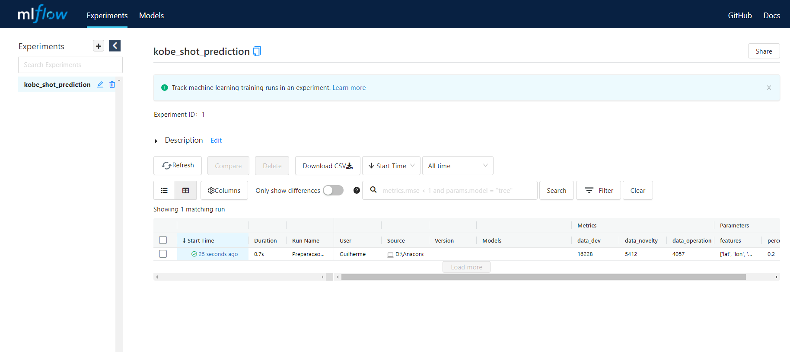
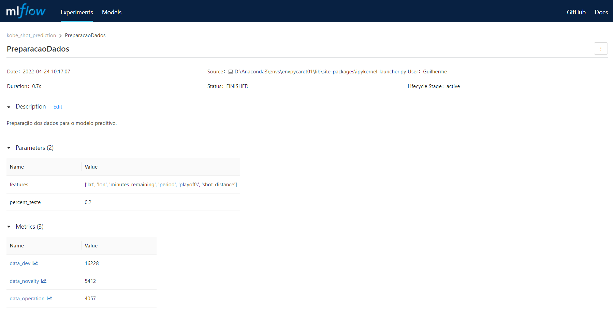
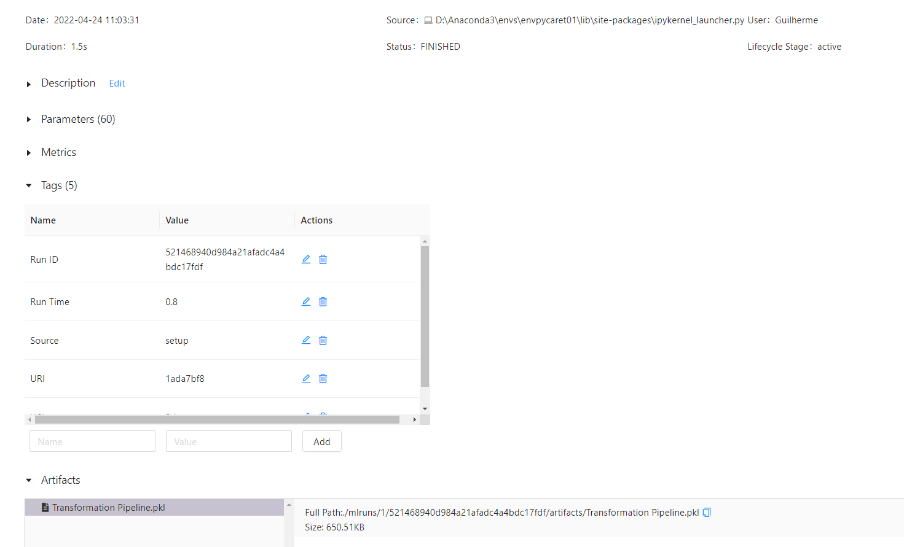
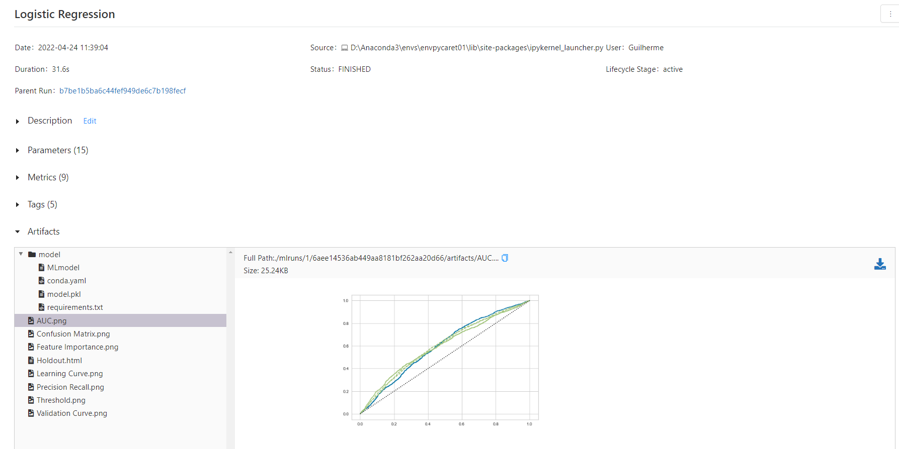
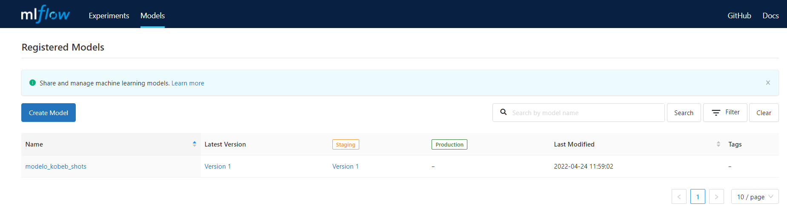
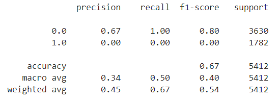
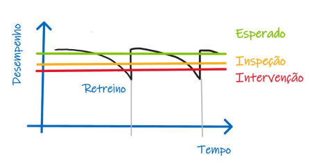
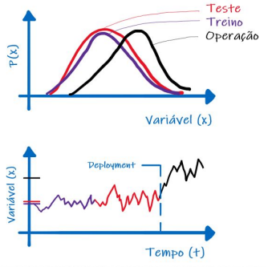

# Kobe Bryant - Análise Preditiva de Acertos
------------
O objetivo deste projeto é contruir um preditor capaz de prever se o astro do basket Kobe Bryant acertou ou errou a cesta, analisando um dataset com registros completos dos seus arremessos, com atributos como latitude e longitute na quadra, tipo de arremesso, tempo faltante, entre outros.

Link para o [dataset](https://www.kaggle.com/code/jeongwonkim10516/kobe-bryant-shot-selection-increase-prediction/data").

Para este experimento, utilizaremos duas abordagens, regressão logística e árvore de decisão, e demonstraremos o processo completo de um projeto de machine learning, desde o coleta e preparação dos dados, passando pelo pré-processamento, treinamento e avaliação, monitoramento, atualização e deploymento.

O projeto seguirá o framework TDSP (Team Data Science Process) da Microsoft. Um framework ágil com metodologia de data science interativa proposto para entregar soluções de ML de forma eficiente (MLOps). O foco do TDSP é garantir a colaboração e a otimização do trabalho entre pessoas/times através de melhores práticas de implementação e infraestrutura levantadas pela Microsoft junto com grandes players do mercado no cenário de aplicações inteligentes e machine learning.

A ilustração abaixo demostra o ciclo de vida de uma aplicação de data science:

Os principais papéis envolvidos num projeto de data science, segundo o TDPS são: 

* Solution architect
* Project manager
* Data engineer
* Data scientist
* Application developer
* Project lead

O ilustração a seguir descreve as principais responsabilidades de cada papel dentro de um projeto de DS. Importante ressaltar que este projeto demonstrará as responsabilidades do Data scientist:

Para desenvolvimento do modelo utilizaremos como principal biblioteca o pyCaret,  uma biblioteca de AutoML do Python que permite o desenvolvimento de todo o ciclo da criação de um modelo de Machine Learning com poucas linhas de código.

Para rastreamento e monitoramento do modelo utilizaremos o MLFlow em conjunto com o streamLit. O MLFlow é uma biblioteca open-source para gerenciar o ciclo de vida dos experimentos, e o streamlit, é um framework também open-source, cujo principal objetivo é disponibilizar o projeto em produção, através de dashboards interativos, sem a necessidade de conhecer ferramentas de front-end ou de deploy de aplicações.

Com o MLFlow, faremos o controle do nosso modelo entre os pipelines de desenvolvimento e producão. A implementação de pipelines distintos é importante e necessária, pois podem haver diversas diferenças entre os dois cenários, como:

* Ausência da resposta correta para avaliarmos o modelo no ambiente de desenvolvimento, pois utilizamos muitas vezes bases offline com fotografias até determinada data, e os dados de produção serão os mais atuais possível.
* Pipelines distintos de coleta de dados entre ambiente de dev e produção, onde muitas vezes em produção necessitaremos do complemento de algumas informações.
* Diferentes condições de operação (frequência de resposta, latência…)
* Apresentação do resultado para usuário final de forma a disponibilizar insumos para análises e tomadas de decisão
* Retreinamento dos modelos em produção para recalibração dos parâmetro.
* Segurança nas manutenções, mitigando o risco de quebra da aplicação em produção.

## Descrição das Etapas

No notebook, simularemos as etapas do projeto de ponta a ponta.

Dividiremos p notebook nas seguintes etapas:

* Preparação dos dados
* Treinamentos dos modelos
* Aprovação do modelo
* Operacionalização

Para registro do modelo e das ações durante o experimento, utilizaremos o MLFlow.
O MLFLow possibilita o registro das rodadas através de **runs** que registram informações importantes como horaício, duração, usuário de executou, as fontes de dados e principalmente, os parâmetros, métricas e artefatos resultantes daquela execução.

Falaremos um pouco de cada uma das etapas com mais detalhes a seguir.

## Preparação dos dados

Nosso dataset original possui 30697 registros com 25 colunas. Para este projetos desconsideraremos os missing values, o que resultará num dataset de 25697 registros.

Para simplificação do problema, utilizaremos apenas 6 features:

* lat
* lon
* minutes remaining
* period
* playoffs
* shot_distance

E por fim dividiremos o dataset em dois, onde todos os registros correspondentes ao arremessos de 2 pontos serão utilizados no treinamento do modelo, e o registros correspondentes a arremessos de 3 pontos serão utilizados para simulador dados de operação, quando o modelo estiver em produção.

O run referente a esta etapa terá o nome de *PreparacaoDados* e registrará como parâmetros as features consideradas e a porcentagem reservada para o dataset de teste e como métricas teremos o tamanho de cada dataset, considerando treino, teste e novidade.

Para a separação dos datasets, passaremos o parâmetro *stratify=Y*, isso garantirá que a divisão manterá as proporções das classes entre os dois datasets, e ajudará a reduzir o efeito de viés de dados no modelo.

Feita a execução dentro do Run, todo o registro é gravado no MLFlow.

<kbd>
  
</kbd>

Na figura acima podemos observar na faixa esquerda, o experimento criado com o nome *kobeb_shot_prediction* e no centro os runs executado até então, com informações básicas da execução. Se clicarmos no da linha referente ao run, podemos vizualizar todos os registros coletados pelo MLFlow:

<kbd>
  
</kbd>

Temos registrados os parâmetros e métricas citados anteriormente, não há artefatos nesta execução.

Esta execução gerou dois arquivos parquet, data_train.parquet e data_test.parquet, e estes foram salvou na pasta do projeto.

## Treinamentos dos modelos

Para iniciar o treinamento, faremos a leitura dos arquivos gerados na execução anterior. O desenvolvimento está sendo feito em apenas um notebook, porém estamos simulando um ambiente de produção, onde uma ferramenta de pipeline estaria executando os códigos, e estes poderiam estar divididos em diversos notebooks, ou arquivos .py.

Nesta etapa, começaremos a utilizar a biblioteca pyCaret para desenvolvimento do modelo.
Iniciaremos com o setup, onde toda a parametrização do modelo é feita. Alguns parametros que devemos destacar:

* test_data: Este parametro especifica o dataset de teste a ser utilizado. Como fizemos a divisão na etapa anterior, utilizaremos o dataset de teste já criado. Este paramentro anula  o test_size, caso ele seja utilizado.

* log_experiment,log_plots, experiment_name: Aqui estaremos garantindo que o MLFlow fará os registros do experimento e dos plots em sua base.

* fold_strategy: Neste parâmetro definimos a estratégia de Kfold. Como estamos trabalhando num problema de classificação, a estratégia estratificada é a maior indicada, pois ela garantirá que a proporção das classes será mantida em cada fold.

* silent: Como estamos simulando um ambiente de produção, onde a execução será automática, o silent ocultará o prompt de confirmação.

Além das métricas padrões do pyCaret.classification adicionaremos a métrica logloss em nosso modelos.

Feita a execução, todos os registros são gravados no MLFlow e é gerado um arquivo .pkl com o pipeline referente a este setup. Todos os parametros do setup também foram registrados:

<kbd>
  
</kbd>

Nos dois runs seguintes, serão executados os treinamentos. Os modelos utilizados serão a Regressão Logística, e o segundo modelos será selecionado pelo método do pyCaret *compare_models*, que fará a comparação entre a árvore de decisão e o SVM, e escolherá o que obtiver o melhor f1 score. Neste caso, o selecionado foi a árvore de decisão.

Será executado um run para cada modelo, porém os registros efetuados serão iguais, probability_threshold e cross_validation como parâmetros, todas as métricas padrões de classificão do sklearn + o logloss e os plots.

<kbd>
  
</kbd>

Neste run todos os plots ficam salvos como artefatos, e disponíveis para consulta, assim como o próprio modelo, os requerimentos e etc.

## Aprovação do modelo

Nesta etapa, simularemos um run de aprovação do modelo, onde o objetivo é garantir que o novo modelo só subirá para o Staging se atingir uma precisão mínima.  

Com a precisão atingida, o MLFlow registrará o pipeline de modelagem com uma nova versão e colocará no ambiente de staging.

<kbd>
  
</kbd>

## Operacionalização

Para testar a aderência do modelo a uma nova base de dados totalmente desconhecida e com padrões de dados diferentes, utilizaremos a chamado ao método POST invocations da API do MLFlow, utilizando a biblioteca requests para montar a requisição.

Como resultado o método devolve a predição da variável alvo, e assim podemos comparar com a base original e validar a aderência:

<kbd>
  
</kbd>

Apesar de do f1 score alto, o modelo não foi aderente a dados de características diferentes, neste caso arremessos de 3pt, pois considerou todos os arremessos como erros, e nenhuma cesta. 

### Monitoramentos e Alarmes

Com o modelo em produção, devemos nos preocupar com a saúde do mesmo e garantir que saberemos o momento certo de uma reavaliação e/ou retreinamento. Algumas estratégias ajudam neste momento.

Em sistemas com disponibilidade da variável de resposta em produção, podemos utilizar a flutuação dos dados de teste ou a resposta da validação cruzada para determinar o momento certo para o retreinamento.

<kbd>
  
</kbd>

Em sistemas sem disponibilidade da variável de resposta em produção, podemos monitorar a distribuição das 
variáveis de entrada e saída com médias, desvios 
padrões e divergências. Aqui também podemos utilizar amostras out-of-time para referência e para evulução de métricas em produção.

<kbd>
  
</kbd>

Para o retreinamento temos estratégias distintas que pode ser utilizadas, reativa e preditiva. Deve levar em conta a qualidade dos dados, a aplicação, a disponibilidade dos dados. 

* Estratégia Reativa: o modelo é retreinado quando a métrica de desempanho escolhida atingir um valor inferior ao valor nominal do modelo.

* Estratégia Preditiva: o modelo é retreinado quando é observado desvio de dados e conceitos, antevendo possíveis quedas de desempenho.

### Dashboard de monitoramento

Para monitorar a operação do nosso modelo, criamos um dashboard utilizando a ferramento Streamlit.

Arquivo: **dashboard_monitoramento.py**

<kbd>
  
</kbd>

<kbd>
  
</kbd>

<kbd>
  
</kbd>